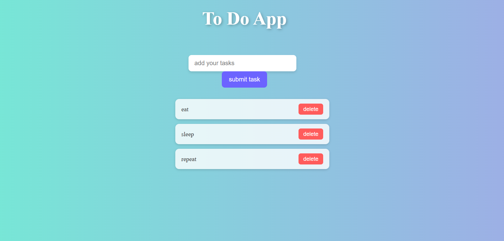

# To-do-app-
Simple and stylish To-Do List app built with HTML, CSS, and JavaScript.

📝 To-Do App
A sleek and modern To-Do List web application built with HTML, CSS, and JavaScript. This app allows users to add tasks, view them in a clean, animated list, and delete tasks once completed. It features a responsive design with smooth animations and an elegant glassmorphism style. ✨

Features ⭐
-✅ Add new tasks with validation to prevent empty entries

-🗑️ Delete tasks dynamically with an intuitive delete button

-📱 Responsive UI that adapts to different screen sizes

-🎨 Smooth animations for task addition and deletion

-💎 Stylish design using CSS gradients, shadows, and glass effects

Technologies Used 💻
1.HTML5

2.CSS3 (with modern effects and animations)

3.Vanilla JavaScript (DOM manipulation and event delegation)

How to Use 🚀
-🖊️ Enter your task in the input box.

-➕ Click Submit Task to add it to the list.

-🗑️ Click the Delete button next to a task to remove it.

## Preview

